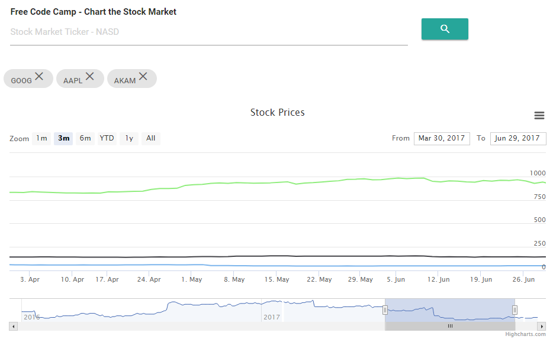

# fcc-chart-stocks-v2
Free Code Camp - Chart the Stock Market

## Purpose - Chart the Stock Market
https://www.freecodecamp.org/challenges/chart-the-stock-market

## Here are the specific user stories you should implement for this project

User Story: I can view a graph displaying the recent trend lines for each added stock.

User Story: I can add new stocks by their symbol name.

User Story: I can remove stocks.

User Story: I can see changes in real-time when any other user adds or removes a stock.

